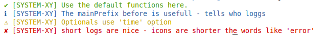
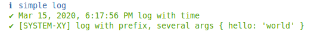

# rf-log

* Simple NodeJS logging lib - no dependencys.
* Colored console.log or log to files.
* Default logging functions: info, success, warning, error.
* Custom functions can be added.
* Display prefix and time for the logs.

## Getting Started

> npm install rf-log



```js
var log = require(rf-log);
log.options.mainPrefix = "[SYSTEM-XY]"; // set options

// you are ready to use
log.success("Use the default functions here.");
log.info("The mainPrefix before is usefull - tells who loggs");
log.warning("Optionals use 'time' option");
log.error("short logs are nice - icons are shorter than words like 'error'");

```

## Further Options




```js
var log = require(rf-log);

log.info("does this work?");

log.options.mainPrefix = "[SYSTEM-XY]"; // set option
log.success("this works", {"hello": "world"});

log.options.time = true; // set option
log.success("this works also with time");

// add custom loggin function; (name, color, prefix, filePath)
log.addLoggingFunction("customLoggingFunction", "\x1b[41m", "✘");
log.customLoggingFunction("customLog", {"hello World2": 123});

```

### Log to one file

```js
var log = require(rf-log);

log.options.logFile = __dirname +  "/log.txt";
log.success("this works", {"hello": "world"});

```

### Log to several files (separate Error file)

```js
var log = require(rf-log);

// overwrite default error function
log.addLoggingFunction("error", "\x1b[31m", "✘",  __dirname +  "/errors.txt");

log.error("errors in separate file");
log.success("But only errors! Success is still on console");

```


## Options

```js
options: {
    mainPrefix: "",
    time: false,
    logFile: false,
    carriageReturn: true
}
```

## Color table
(from http://stackoverflow.com/questions/9781218/how-to-change-node-jss-console-font-color)

```
Reset = "\x1b[0m"
Bright = "\x1b[1m"
Dim = "\x1b[2m"
Underscore = "\x1b[4m"
Blink = "\x1b[5m"
Reverse = "\x1b[7m"
Hidden = "\x1b[8m"

FgBlack = "\x1b[30m"
FgRed = "\x1b[31m"
FgGreen = "\x1b[32m"
FgYellow = "\x1b[33m"
FgBlue = "\x1b[34m"
FgMagenta = "\x1b[35m"
FgCyan = "\x1b[36m"
FgWhite = "\x1b[37m"

BgBlack = "\x1b[40m"
BgRed = "\x1b[41m"
BgGreen = "\x1b[42m"
BgYellow = "\x1b[43m"
BgBlue = "\x1b[44m"
BgMagenta = "\x1b[45m"options.
BgCyan = "\x1b[46m"
BgWhite = "\x1b[47m"
```

## Legal Issues
* Licenese: MIT
* Author: Felix Furtmayr
