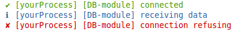

# rf-log

* Simple NodeJS logging lib - no dependencys.
* Colored console.log or log to files.
* Default logging functions: info, success, warning, error.
* Custom functions can be added.
* Display prefix and time for the logs.

## Getting Started

> npm install rf-log


```js
var log = require(rf-log);
log.options.mainPrefix = "[SYSTEM-XY]"; // set options

// you are ready to use
log.success("Use the default functions here.");
log.info("The mainPrefix before is usefull - tells who loggs");
log.warning("Optionals use 'time' option");
log.error("short logs are nice - icons are shorter than words like 'error'");
log.critical("same as 'error', but also throws an Error and stops your app");


```


### Custom prefix logger



In projects bigger an additional prefix for each module enables you to find errors faster. On the other side it prevents that you repeat the module name unnecessary in a library.

**Example for one library in your code**

```js
// NOTE: a main prefix has already been set before somewhere else to '[yourProcess]'


/** DB Module
 * @desc your super fast and cool db module
 * @version 0.0.3
 */

// start the logger and tell it the name of your lib
var moduleName = '[DB-module]'
var log = require('rf-log').customPrefixLogger(moduleName)


// now use it somewhere
// no need to mention in your logging messages, that this is the `DB Module`
log.success('connceted')

log.info('receiving data')

log.error('connection refusing')


```

## Further Options


```js
var log = require(rf-log);

log.info("does this work?");

log.options.mainPrefix = "[SYSTEM-XY]"; // set option
log.success("this works", {"hello": "world"});

log.options.time = true; // set option
log.success("this works also with time");

// add custom loggin function; (name, color, prefix, filePath)
log.addLoggingFunction("customLoggingFunction", "\x1b[41m", "✘");
log.customLoggingFunction("customLog", {"hello World2": 123});

```

### Log to one file

```js
var log = require(rf-log);

log.options.logFile = __dirname +  "/log.txt";
log.success("this works", {"hello": "world"});

```

### Log to several files (separate Error file)

```js
var log = require(rf-log);

// overwrite default error function
log.addLoggingFunction("error", "\x1b[31m", "✘",  __dirname +  "/errors.txt");

log.error("errors in separate file");
log.success("But only errors! Success is still on console");

```


## Options

```js
var options = require(rf-log).options;
// the object is in every `require(rf-log)` present and looks like:
{
    mainPrefix: "",
    time: false,
    logFile: false,
    carriageReturn: true
}

```

## Development and Testing

> npm install

To be able to run grunt-eslint. Run a test script and `eslint` with:

> `npm test`


## Legal Issues
* Licenese: MIT
* Author: Felix Furtmayr
