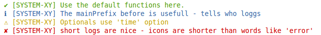

# rf-log

* Simple NodeJS logging lib - no dependencys.
* Ready to use, little configuration.
* Default logging functions: info, success, warning, error
* Colored console.log with symbol prefixes
* Display a main prefix for your projects like `[ProcessXY]`
* Display a prefix for each of your libs in a projects like `[ProcessXY][DB Module]`
* Time logging option
* Log to files option
* Custom logging functions can be added

## Getting Started

> npm install rf-log



```js
var log = require(rf-log);
log.options.mainPrefix = "[SYSTEM-XY]"; // set options

// you are ready to use
log.success("Use the default functions here.");
log.info("The mainPrefix before is usefull - tells who loggs");
log.warning("Optionals use 'time' option");
log.error("short logs are nice - icons are shorter than words like 'error'");
log.critical("same as 'error', but also throws an Error and stops your app");


```


### Custom prefix logger


```js
// NOTE: a main prefix has already been set before somewhere else to '[yourProcess]'


/** DB Example Module
 * @desc your super fast and cool db module
 * @version 0.0.3
 */

// start the logger and tell it the name of your lib
var log = require('rf-log').customPrefixLogger('[DB-module]')


// use it. never mention `DB Module` again - `rf-log` does this fo you.
log.success('connceted')

log.info('receiving data')

log.error('connection refusing')

```
In bigger projects an additional prefix for each module enables you to find errors faster. It also prevents unnecessary repeating of the module name in a library in logging messages.


## Further Options


```js
var log = require(rf-log);

log.info("does this work?");

log.options.mainPrefix = "[SYSTEM-XY]"; // set option
log.success("this works", {"hello": "world"});

log.options.time = true; // set option
log.success("this works also with time");

// add custom loggin function; (name, color, prefix, filePath)
log.addLoggingFunction("customLoggingFunction", "\x1b[41m", "✘");
log.customLoggingFunction("customLog", {"hello World2": 123});

```

### Log to one file

```js
var log = require(rf-log);

log.options.logFile = __dirname +  "/log.txt";
log.success("this works", {"hello": "world"});

```

### Log to several files (separate Error file)

```js
var log = require(rf-log);

// overwrite default error function
log.addLoggingFunction("error", "\x1b[31m", "✘",  __dirname +  "/errors.txt");

log.error("errors in separate file");
log.success("But only errors! Success is still on console");

```


## Options

```js
var options = require(rf-log).options;
// the object is in every `require(rf-log)` present and looks like:
{
    mainPrefix: "",
    time: false,
    logFile: false,
    carriageReturn: true
}

```

## Development and Testing

> npm install

To be able to run grunt-eslint. Run a test script and `eslint` with:

> `npm test`


## Legal Issues
* Licenese: MIT
* Author: Felix Furtmayr
